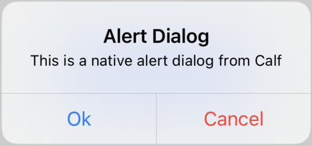
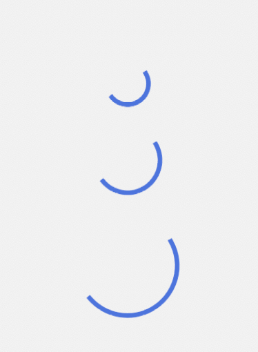
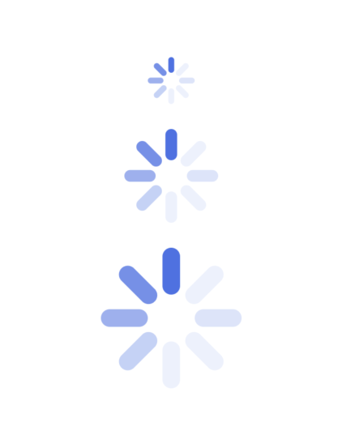
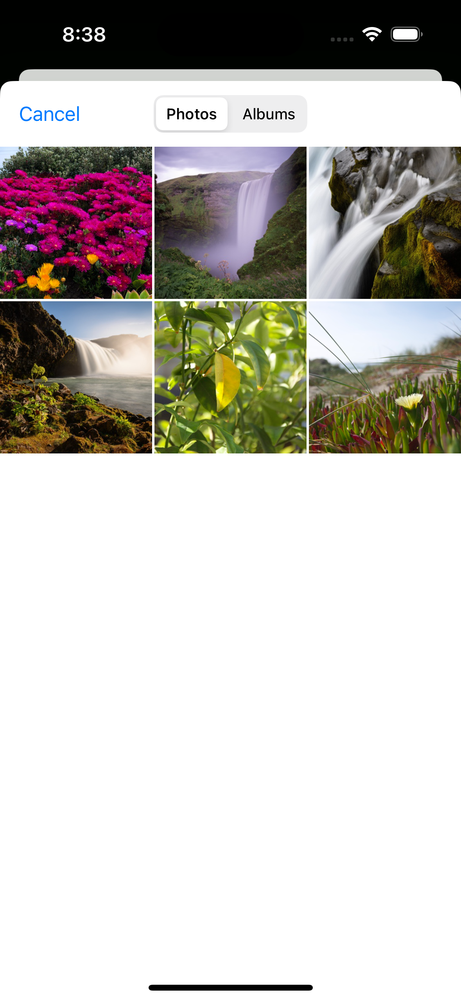

# Calf - Compose Adaptive Look & Feel

Calf is a library that allows you to easily create adaptive UIs for your Compose Multiplatform apps.


[](http://kotlinlang.org)
[](https://github.com/MohamedRejeb)
[](https://opensource.org/licenses/Apache-2.0)
[](https://github.com/MohamedRejeb/ksoup/actions)
[](https://search.maven.org/search?q=g:%22com.mohamedrejeb.calf%22%20AND%20a:%calf-ui%22)

## Artifacts

| Artifact              | Description                               | Platforms             | Version                                                                                                                                                                                           |
|-----------------------|-------------------------------------------|-----------------------|---------------------------------------------------------------------------------------------------------------------------------------------------------------------------------------------------|
| **calf-ui**           | Adaptive UI components                    | Android, iOS, Desktop | [](https://search.maven.org/search?q=g:%22com.mohamedrejeb.calf%22%20AND%20a:%calf-ui%22)                   |
| **calf-file-picker**  | Native File Picker wrapper                | Android, iOS, Desktop | [](https://search.maven.org/search?q=g:%22com.mohamedrejeb.calf%22%20AND%20a:%calf-file-picker%22) |
| **calf-navigation**   | Native navigation wrapper                 | Coming soon... 🚧 🚧  | Coming soon... 🚧 🚧                                                                                                                                                                              |
| **calf-map**          | Native Maps wrapper                       | Coming soon... 🚧 🚧  | Coming soon... 🚧 🚧                                                                                                                                                                              |
| **calf-media**        | Video/Audio player                        | Coming soon... 🚧 🚧  | Coming soon... 🚧 🚧                                                                                                                                                                              |
| **calf-permissions**  | API that allows you to handle permissions | Coming soon... 🚧 🚧  | Coming soon... 🚧 🚧                                                                                                                                                                              |
| **calf-notification** | Notification manager                      | Coming soon... 🚧 🚧  | Coming soon... 🚧 🚧                                                                                                                                                                              |
| **calf-sf-symbols**   | Apple SF Symbols icons                    | Coming soon... 🚧 🚧  | Coming soon... 🚧 🚧                                                                                                                                                                              |

## Installation

[](https://search.maven.org/search?q=g:%22com.mohamedrejeb.calf%22%20AND%20a:%calf-ui%22)

Add the following dependency to your module `build.gradle.kts` file:

```kotlin
// For Adaptive UI components
implementation("com.mohamedrejeb.calf:calf-ui:0.1.0")

// For Adaptive FilePicker
implementation("com.mohamedrejeb.calf:calf-file-picker:0.1.0")
```

If you are using `calf-ui` artifact, make sure to export it to binaries:

#### Regular Framewoek
```kotlin
...
kotlin {
    ...
    targets
        .filterIsInstance<KotlinNativeTarget>()
        .filter { it.konanTarget.family == Family.IOS }
        .forEach {
            it.binaries.framework {
                ...
                export("com.mohamedrejeb.calf:calf-ui:0.1.0")
            }
        }
    ...
}
...
```

#### CocoaPods
```kotlin
...
kotlin {
    ...
    cocoapods {
        ...
        framework {
            ...
            export("com.mohamedrejeb.calf:calf-ui:0.1.0")
        }
    }
    ...
}
...
```

## Usage

### Calf UI

#### AdaptiveAlertDialog

`AdaptiveAlertDialog` is a dialog that adapts to the platform it is running on. It is a wrapper around `AlertDialog` on Android and `UIAlertController` on iOS.

| Android                                                         | iOS                                                     |
|-----------------------------------------------------------------|---------------------------------------------------------|
|  |  |

```kotlin
var showDialog by remember { mutableStateOf(false) }

Button(
    onClick = { showDialog = true },
) {
    Text("Show Alert Dialog")
}

if (showDialog) {
    AdaptiveAlertDialog(
        onConfirm = { showDialog = false },
        onDismiss = { showDialog = false },
        confirmText = "Ok",
        dismissText = "Cancel",
        title = "Alert Dialog",
        text = "This is a native alert dialog from Calf",
    )
}
```

#### AdaptiveBottomSheet

`AdaptiveBottomSheet` is a bottom sheet that adapts to the platform it is running on. It is a wrapper around `ModalBottomSheet` on Android and `UIModalPresentationPopover` on iOS.

| Android                                                         | iOS                                                     |
|-----------------------------------------------------------------|---------------------------------------------------------|
|  |  |

```kotlin
val scope = rememberCoroutineScope()
val sheetState = rememberAdaptiveSheetState()
var openBottomSheet by remember { mutableStateOf(false) }

Box(
    modifier = Modifier.fillMaxSize()
) {
    Button(
        onClick = { openBottomSheet = true },
    ) {
        Text("Show Bottom Sheet")
    }

    if (openBottomSheet) {
        AdaptiveBottomSheet(
            onDismissRequest = { openBottomSheet = false },
            adaptiveSheetState = sheetState,
        ) {
            Button(
                onClick = {
                    scope.launch { sheetState.hide() }.invokeOnCompletion {
                        if (!sheetState.isVisible) {
                            openBottomSheet = false
                        }
                    }
                }
            ) {
                Text("Close")
            }
        }
    }
}
```

#### AdaptiveCircularProgressIndicator

`AdaptiveCircularProgressIndicator` is a circular progress indicator that adapts to the platform it is running on. It is a wrapper around `CircularProgressIndicator` on Android, and it implements similar look to `UIActivityIndicatorView` on iOS.

| Android                                                                                      | iOS                                                                                  |
|----------------------------------------------------------------------------------------------|--------------------------------------------------------------------------------------|
|  |  |

```kotlin
AdaptiveCircularProgressIndicator(
    modifier = Modifier.size(50.dp),
    color = Color.Red,
)
```

#### AdaptiveDatePicker

`AdaptiveDatePicker` is a date picker that adapts to the platform it is running on. It is a wrapper around `DatePicker` on Android and `UIDatePicker` on iOS.

| Android                                                       | iOS                                                   |
|---------------------------------------------------------------|-------------------------------------------------------|
|  |  |

```kotlin
val state = rememberAdaptiveDatePickerState()

LaunchedEffect(state.selectedDateMillis) {
    // Do something with the selected date
}

AdaptiveDatePicker(
    state = state,
)
```

#### AdaptiveTimePicker

`AdaptiveTimePicker` is a time picker that adapts to the platform it is running on. It is a wrapper around `TimePicker` on Android and `UIDatePicker` on iOS.

| Android                                                       | iOS                                                   |
|---------------------------------------------------------------|-------------------------------------------------------|
|  |  |

```kotlin
val state = rememberAdaptiveTimePickerState()

LaunchedEffect(state.hour, state.minute) {
    // Do something with the selected time
}

AdaptiveTimePicker(
    state = state,
    modifier = Modifier
)
```

#### WebView

`WebView` is a view that adapts to the platform it is running on. It is a wrapper around `WebView` on Android and `WKWebView` on iOS.

| Android                                         | iOS                                     |
|-------------------------------------------------|-----------------------------------------|
|  |  |

```kotlin
val state = rememberWebViewState(
    url = "https://github.com/MohamedRejeb"
)

LaunchedEffect(state.isLoading) {
    // Get the current loading state
}

WebView(
    state = state,
    modifier = Modifier
        .fillMaxSize()
)
```

### Calf File Picker

Calf File Picker allows you to pick files from the device storage.

| Android                                                    | iOS                                                |
|------------------------------------------------------------|----------------------------------------------------|
|  |  |

```kotlin
val pickerLauncher = rememberFilePickerLauncher(
    type = FilePickerType.Image,
    selectionMode = FilePickerSelectionMode.Single,
    onResult = { files ->
        files.firstOrNull()?.let { file ->
            // Do something with the selected file
            // You can get the ByteArray of the file
            file.readByteArray()
        }
    }
)

Button(
    onClick = {
        pickerLauncher.launch()
    },
    modifier = Modifier.padding(16.dp)
) {
    Text("Open File Picker")
}
```

## Contribution
If you've found an error in this sample, please file an issue. <br>
Feel free to help out by sending a pull request :heart:.

[Code of Conduct](https://github.com/MohamedRejeb/Calf/blob/main/CODE_OF_CONDUCT.md)

## Find this library useful? :heart:
Support it by joining __[stargazers](https://github.com/MohamedRejeb/Ksoup/stargazers)__ for this repository. :star: <br>
Also, __[follow me](https://github.com/MohamedRejeb)__ on GitHub for more libraries! 🤩

You can always <a href="https://www.buymeacoffee.com/MohamedRejeb"></a>

# License
```markdown
Copyright 2023 Mohamed Rejeb

Licensed under the Apache License, Version 2.0 (the "License");
you may not use this file except in compliance with the License.
You may obtain a copy of the License at

   http://www.apache.org/licenses/LICENSE-2.0

Unless required by applicable law or agreed to in writing, software
distributed under the License is distributed on an "AS IS" BASIS,
WITHOUT WARRANTIES OR CONDITIONS OF ANY KIND, either express or implied.
See the License for the specific language governing permissions and
limitations under the License.
```