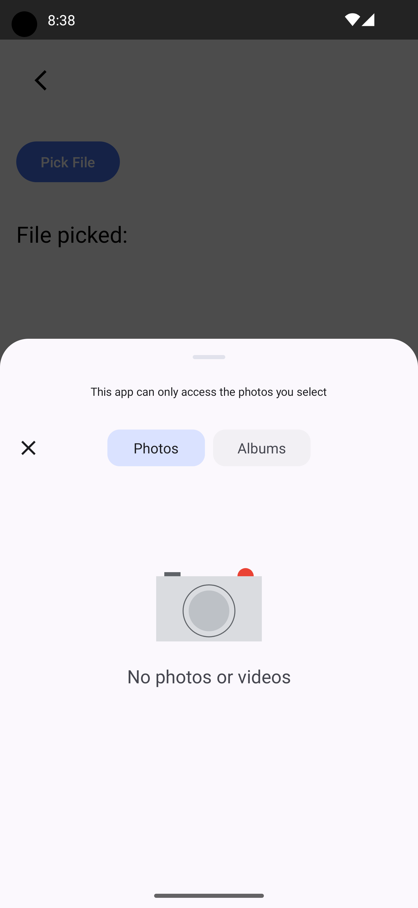
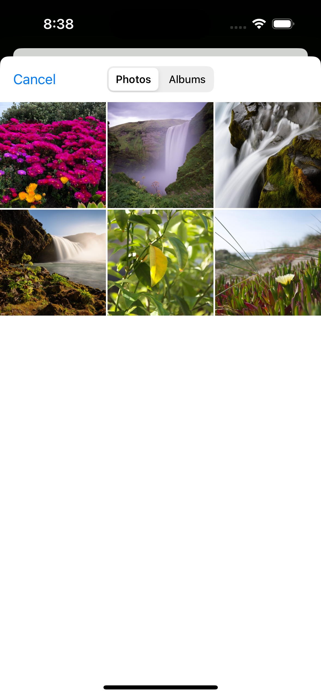
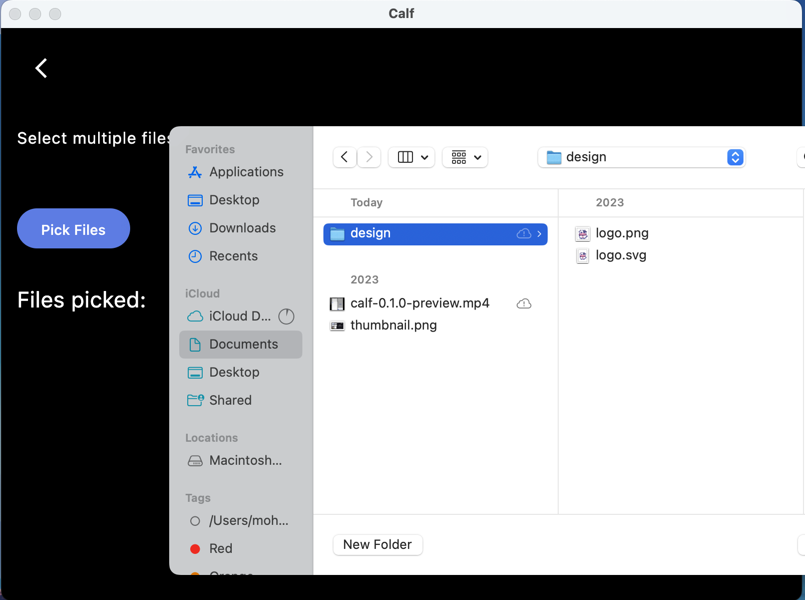
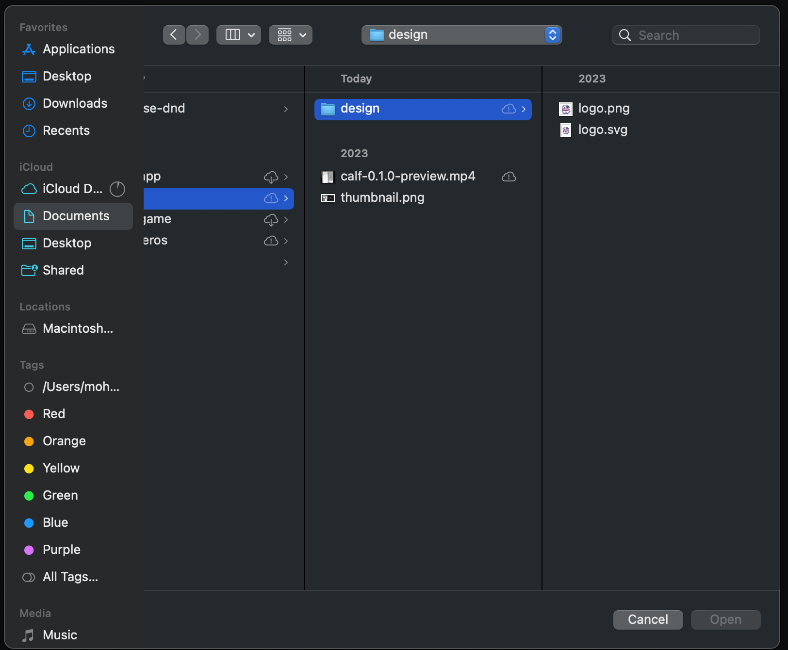

# File Picker

## Installation

[](https://search.maven.org/search?q=g:%22com.mohamedrejeb.calf%22%20AND%20a:%calf-file-picker%22)

```kotlin
implementation("com.mohamedrejeb.calf:calf-file-picker:{{ calf_version }}")
```

## Quick Start

| Android                                                       | iOS                                                   |
|---------------------------------------------------------------|-------------------------------------------------------|
|  |  |

| Desktop                                                       | Web                                                   |
|---------------------------------------------------------------|-------------------------------------------------------|
|  |  |

```kotlin
val scope = rememberCoroutineScope()

val pickerLauncher = rememberFilePickerLauncher(
    type = FilePickerFileType.Image,
    selectionMode = FilePickerSelectionMode.Single,
    onResult = { files ->
        scope.launch {
            files.firstOrNull()?.let { file ->
                // Do something with the selected file
                // You can get the ByteArray of the file
                file.readByteArray()
            }
        }
    }
)

Button(
    onClick = {
        pickerLauncher.launch()
    },
    modifier = Modifier.padding(16.dp)
) {
    Text("Open File Picker")
}
```

## Settings

Use `FilePickerSettings` to customize the dialog behavior:

```kotlin
val pickerLauncher = rememberFilePickerLauncher(
    type = FilePickerFileType.Image,
    settings = FilePickerSettings(
        title = "Select an image",
        initialDirectory = "/home/user/Pictures",
    ),
    onResult = { files -> /* ... */ }
)
```

Or use `rememberFilePickerSettings` inside a `@Composable` to automatically recompose when settings change:

```kotlin
val settings = rememberFilePickerSettings(
    title = dialogTitle,
    initialDirectory = selectedDirectory,
)

val pickerLauncher = rememberFilePickerLauncher(
    type = FilePickerFileType.Image,
    settings = settings,
    onResult = { files -> /* ... */ }
)
```

Common properties available on all platforms:

- `title` - Dialog window title
- `initialDirectory` - Directory to open the dialog in
- `imageRepresentationMode` - Controls how iOS returns image assets (see [iOS Image Representation](#ios-image-representation))

Desktop adds an additional property:

- `parentWindow` - The `ComposeWindow` to attach the dialog to (see [Desktop Setup](#desktop-setup))

### iOS Image Representation

By default, the iOS photo picker transcodes images to a compatible format (e.g. HEIC → JPEG) so they can be displayed with Compose/Skia. If you need the original format (HEIC, RAW, etc.), set `imageRepresentationMode` to `Current`:

```kotlin
val settings = FilePickerSettings(
    imageRepresentationMode = ImageRepresentationMode.Current,
)
```

- `ImageRepresentationMode.Compatible` (default) - Transcodes to JPEG. Recommended for displaying images with Compose.
- `ImageRepresentationMode.Current` - Returns original format. Use when you handle decoding yourself or need original quality.

> This setting only affects iOS. It is ignored on other platforms.

## File Types

`FilePickerFileType` controls which files the user can select:

- `FilePickerFileType.Image` - Images only
- `FilePickerFileType.Video` - Videos only
- `FilePickerFileType.ImageVideo` - Images and videos
- `FilePickerFileType.Audio` - Audio files only
- `FilePickerFileType.Document` - Documents only
- `FilePickerFileType.Text` - Text files only
- `FilePickerFileType.Pdf` - PDF files only
- `FilePickerFileType.All` - All file types
- `FilePickerFileType.Folder` - Folders only

Filter by MIME type:

```kotlin
val type = FilePickerFileType.Custom(
    listOf("text/plain")
)
```

Filter by extension:

```kotlin
val type = FilePickerFileType.Extension(
    listOf("txt")
)
```

## Selection Modes

- `FilePickerSelectionMode.Single` - Pick a single file
- `FilePickerSelectionMode.Multiple` - Pick multiple files (unlimited)
- `FilePickerSelectionMode.Multiple(maxItems = 5)` - Pick up to 5 files

### Limiting Selection Count

You can limit the number of files the user can select by passing `maxItems` to `Multiple`:

```kotlin
val pickerLauncher = rememberFilePickerLauncher(
    type = FilePickerFileType.Image,
    selectionMode = FilePickerSelectionMode.Multiple(maxItems = 5),
    onResult = { files ->
        // files.size will be at most 5
    }
)
```

On **Android** (visual media picker) and **iOS** (PHPicker), the limit is enforced natively by the picker UI — the user cannot select more than `maxItems` files. On all other platforms and picker types, the result list is truncated to `maxItems` after selection.

Passing `null` (the default) allows unlimited selection. `FilePickerSelectionMode.Multiple` without parentheses is equivalent to `Multiple(maxItems = null)`.

## Desktop Setup

#### macOS Dark Theme

The file dialog follows the application's theme. To enable dark mode support on macOS, add this JVM argument to your Gradle configuration:

```kotlin
compose.desktop {
    application {
        nativeDistributions {
            macOS {
                jvmArgs(
                    "-Dapple.awt.application.appearance=system",
                )
            }
        }
    }
}
```

> Make sure to use the Gradle `run` task. Other run configurations (e.g. `hotRun`, `jvmRun`) may ignore these settings.

#### Parent Window

To attach the file dialog to the current window, you have three options:

#### Option 1: ProvideFilePickerParentWindow (recommended)

Wrap your content with `ProvideFilePickerParentWindow` to automatically provide the parent window to all file pickers in the tree:

```kotlin
fun main() = application {
    Window(onCloseRequest = ::exitApplication) {
        ProvideFilePickerParentWindow {
            App()
        }
    }
}
```

#### Option 2: FrameWindowScope extension

Use the `FrameWindowScope.rememberFilePickerLauncher` extension, which auto-captures the window:

```kotlin
fun main() = application {
    Window(onCloseRequest = ::exitApplication) {
        val pickerLauncher = rememberFilePickerLauncher(
            type = FilePickerFileType.Image,
            onResult = { files -> /* ... */ }
        )
    }
}
```

#### Option 3: Explicit settings

Pass the window directly through `FilePickerSettings`:

```kotlin
val window = LocalFilePickerParentWindow.current

val pickerLauncher = rememberFilePickerLauncher(
    type = FilePickerFileType.Image,
    settings = FilePickerSettings(
        parentWindow = window,
    ),
    onResult = { files -> /* ... */ }
)
```

## Extensions

All `KmpFile` extension functions work without passing a context parameter. On Android, the application context is captured automatically when using `rememberFilePickerLauncher`.

* Read the `ByteArray` of the file using the `readByteArray` extension function:

```kotlin
LaunchedEffect(file) {
    val byteArray = file.readByteArray()
}
```

> The `readByteArray` extension function is a suspending function, so you need to call it from a coroutine scope.

> It's not recommended to use `readByteArray` extension function on large files, as it reads the entire file into memory.
> For large files, it's recommended to use the platform-specific APIs to read the file.
> You can read more about accessing the platform-specific APIs below.

* Check if the file exists using the `exists` extension function:

```kotlin
val exists = file.exists()
```

* Get the file name using the `getName` extension function:

```kotlin
val name = file.getName()
```

* Get the file path using the `getPath` extension function:

```kotlin
val path = file.getPath()
```

* Check if the file is a directory using the `isDirectory` extension function:

```kotlin
val isDirectory = file.isDirectory()
```

> Overloads that accept a `PlatformContext` parameter are still available for backward compatibility.

## File Saver

`rememberFileSaverLauncher` lets the user save a file to a location of their choice. Available on all platforms.

```kotlin
@OptIn(ExperimentalCalfApi::class)
@Composable
fun SaveFileExample() {
    val saverLauncher = rememberFileSaverLauncher(
        onResult = { file ->
            // file is the saved KmpFile, or null if cancelled
            // On web, onResult is not called (downloads are fire-and-forget)
        }
    )

    Button(onClick = {
        saverLauncher.launch(
            bytes = myByteArray,
            baseName = "document",
            extension = "pdf",
        )
    }) {
        Text("Save File")
    }
}
```

**Platform behavior:**

| Platform | Mechanism |
|----------|-----------|
| Android | System document creation dialog (`CreateDocument`) |
| iOS | Export dialog (`UIDocumentPickerViewController`) |
| Desktop | Native save dialog via rfd |
| Web | Browser download — `onResult` is not called since downloads are fire-and-forget |

> `rememberFileSaverLauncher` is annotated with `@ExperimentalCalfApi`.

## Platform-specific APIs

KmpFile is a wrapper around platform-specific APIs,
you can access the native APIs for each platform using the following properties:

##### Android
```kotlin
val uri: Uri = kmpFile.uri
```

##### iOS
```kotlin
val nsUrl: NSURL = kmpFile.url
```

##### Desktop
```kotlin
val file: java.io.File = kmpFile.file
```

##### Web
```kotlin
val file: org.w3c.files.File = kmpFile.file
```

## Coil Extensions

In case you're using [Coil](https://github.com/coil-kt/coil) in your project, Calf has a dedicated package that includes utilities to ease the integration between both libraries.

You can use it by adding the following dependency to your module `build.gradle.kts` file:

```kotlin  
implementation("com.mohamedrejeb.calf:calf-file-picker-coil:{{ calf_version }}")  
```  

Currently, this package contains a `KmpFileFetcher` that you can use to let Coil know how to load a KmpFile by adding it to Coil's  `ImageLoader`:

```kotlin  
ImageLoader.Builder(context)  
 .components { add(KmpFileFetcher.Factory()) }
 .build()  
```  

For more info regarding how to extend the Image Pipeline in Coil, you can read [here](https://coil-kt.github.io/coil/image_pipeline/).
