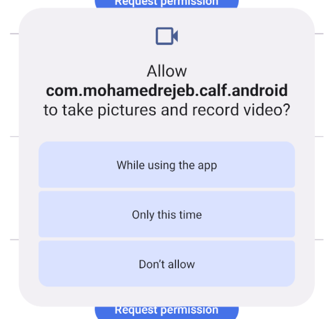
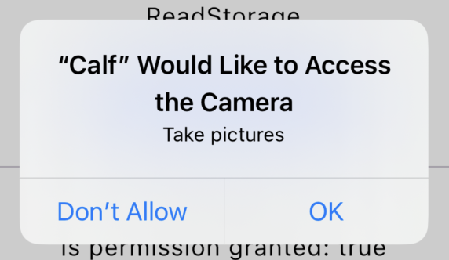

# Permissions

Calf Permissions provides a Compose Multiplatform API for requesting and observing runtime permissions on Android and iOS.

## Why Modular Permissions?

Calf Permissions is split into **individual modules per permission type** instead of shipping as a single monolithic library. This architecture offers several important benefits:

### iOS App Store Compliance

Apple's App Store review process is strict about permission usage. If your app binary links against a permission framework (e.g., `CoreBluetooth`, `EventKit`, `CoreLocation`) but never actually uses it, **Apple may reject your app** or require you to add a usage description for a permission your app doesn't need.

With a monolithic permissions library, your iOS binary would include code for *every* permission type — camera, bluetooth, contacts, calendar, etc. — even if your app only uses the camera. This leads to:

- **App Store rejections** for unused permission frameworks linked in the binary
- **Unnecessary privacy usage descriptions** in your `Info.plist`

By using modular permissions, you **only include the permissions your app actually needs**, so your iOS binary only links against the relevant native frameworks, and you only need to declare the usage descriptions that apply.

## Installation

[](https://search.maven.org/search?q=g:%22com.mohamedrejeb.calf%22%20AND%20a:%calf-permissions%22)

### Option 1: Individual Modules (Recommended)

Add only the permission modules your app actually needs to your module `build.gradle.kts` file:

```kotlin
// Core (required — provides the base API)
implementation("com.mohamedrejeb.calf:calf-permissions-core:0.9.0")

// Add only the permissions you need:
implementation("com.mohamedrejeb.calf:calf-permissions-camera:0.9.0")
implementation("com.mohamedrejeb.calf:calf-permissions-microphone:0.9.0")
implementation("com.mohamedrejeb.calf:calf-permissions-gallery:0.9.0")
implementation("com.mohamedrejeb.calf:calf-permissions-location:0.9.0")
implementation("com.mohamedrejeb.calf:calf-permissions-bluetooth:0.9.0")
implementation("com.mohamedrejeb.calf:calf-permissions-contacts:0.9.0")
implementation("com.mohamedrejeb.calf:calf-permissions-calendar:0.9.0")
implementation("com.mohamedrejeb.calf:calf-permissions-notifications:0.9.0")
implementation("com.mohamedrejeb.calf:calf-permissions-wifi:0.9.0")
```

For example, if your app only needs camera and location permissions:

```kotlin
implementation("com.mohamedrejeb.calf:calf-permissions-core:0.9.0")
implementation("com.mohamedrejeb.calf:calf-permissions-camera:0.9.0")
implementation("com.mohamedrejeb.calf:calf-permissions-location:0.9.0")
```

### Option 2: Umbrella Module

If you want all permissions at once (not recommended for iOS App Store submissions):

```kotlin
implementation("com.mohamedrejeb.calf:calf-permissions:0.9.0")
```

!!! warning
    The umbrella module includes **all** permission modules. On iOS, this means your binary will link against all native permission frameworks, which may cause App Store review issues if you don't use all of them.

## Module Architecture

The permissions library is organized as follows:

```
calf-permissions/
├── build.gradle.kts          ← umbrella module (includes all)
├── core/                     ← calf-permissions-core (base API + permissions that don't require adding keys to `Info.plist`)
├── camera/                   ← calf-permissions-camera
├── microphone/               ← calf-permissions-microphone
├── gallery/                  ← calf-permissions-gallery
├── location/                 ← calf-permissions-location
├── bluetooth/                ← calf-permissions-bluetooth
├── contacts/                 ← calf-permissions-contacts
├── calendar/                 ← calf-permissions-calendar
├── notifications/            ← calf-permissions-notifications
└── wifi/                     ← calf-permissions-wifi
```

Each module depends on `calf-permissions-core`, which provides the shared API (`Permission`, `PermissionState`, `rememberPermissionState`, etc.). The platform-specific permission handling is implemented in each individual module.

Permissions that don't require adding a reason in the iOS `Info.plist` (because they are always granted on iOS) are included directly in the **core** module. This includes storage permissions (`ReadStorage`, `WriteStorage`), `ReadAudio`, and `Call`.

## Usage

### Single Permission

Use `rememberPermissionState(permission: Permission)` to request a single permission and observe its status:

```kotlin
// Camera permission state
val cameraPermissionState = rememberPermissionState(
    Permission.Camera
)

if (cameraPermissionState.status.isGranted) {
    Text("Camera permission Granted")
} else {
    Button(
        onClick = { cameraPermissionState.launchPermissionRequest() }
    ) {
        Text("Request permission")
    }
}
```

### Multiple Permissions

Use `rememberMultiplePermissionsState(permissions: List<Permission>)` to request multiple permissions at the same time:

```kotlin
val multiplePermissionsState = rememberMultiplePermissionsState(
    permissions = listOf(
        Permission.Camera,
        Permission.FineLocation
    )
)

if (multiplePermissionsState.allPermissionsGranted) {
    Text("All permissions granted")
} else {
    Button(
        onClick = { multiplePermissionsState.launchMultiplePermissionRequest() }
    ) {
        Text("Request permissions")
    }
}
```

| Android                                                      | iOS                                                  |
|--------------------------------------------------------------|------------------------------------------------------|
|  |  |

## Permissions Reference

### Core Permissions

The following permissions are included in the **core** module (`calf-permissions-core`) because they are always granted on iOS and don't require an `Info.plist` entry.

#### Storage Permissions

##### Read Storage Permission

To request the read storage permission, use `Permission.ReadStorage`.

###### Android

Add the following permission to your `AndroidManifest.xml` file:

```xml
<uses-permission android:name="android.permission.READ_EXTERNAL_STORAGE" />
```

###### iOS

This permission is always granted on iOS.

##### Write Storage Permission

To request the write storage permission, use `Permission.WriteStorage`.

###### Android

Add the following permission to your `AndroidManifest.xml` file:

```xml
<uses-permission android:name="android.permission.WRITE_EXTERNAL_STORAGE" />
<uses-permission android:name="android.permission.MANAGE_EXTERNAL_STORAGE"
    tools:ignore="ScopedStorage" />
```

###### iOS

This permission is always granted on iOS.

#### Read Audio Permission

To request the read audio permission, use `Permission.ReadAudio`.

##### Android

Add the following permission to your `AndroidManifest.xml` file (Android 13+):

```xml
<uses-permission android:name="android.permission.READ_MEDIA_AUDIO" />
```

##### iOS

This permission is always granted on iOS.

#### Call Permission

To request the call permission, use `Permission.Call`.

##### Android

Add the following permission to your `AndroidManifest.xml` file:

```xml
<uses-permission android:name="android.permission.CALL_PHONE" />
```

##### iOS

This permission is always granted on iOS.

### Gallery Permissions

**Module:** `calf-permissions-gallery`

To request gallery permissions, use `Permission.Gallery`, `Permission.ReadImage`, or `Permission.ReadVideo`.

#### Gallery Permission

To request the gallery permission, use `Permission.Gallery`.

##### Android

Add the following permission to your `AndroidManifest.xml` file:

```xml
<uses-permission android:name="android.permission.READ_EXTERNAL_STORAGE" />
```

##### iOS

Add the following key to your `Info.plist` file:

```xml
<key>NSPhotoLibraryUsageDescription</key>
<string>Gallery permission is required to pick images</string>
```

The string value is the message that will be displayed to the user when the permission is requested.

#### Read Image Permission

To request the read image permission, use `Permission.ReadImage`.

##### Android

Add the following permission to your `AndroidManifest.xml` file (Android 13+):

```xml
<uses-permission android:name="android.permission.READ_MEDIA_IMAGES" />
```

##### iOS

Add the following key to your `Info.plist` file:

```xml
<key>NSPhotoLibraryUsageDescription</key>
<string>Photo library permission is required to read images</string>
```

The string value is the message that will be displayed to the user when the permission is requested.

#### Read Video Permission

To request the read video permission, use `Permission.ReadVideo`.

##### Android

Add the following permission to your `AndroidManifest.xml` file (Android 13+):

```xml
<uses-permission android:name="android.permission.READ_MEDIA_VIDEO" />
```

##### iOS

Add the following key to your `Info.plist` file:

```xml
<key>NSPhotoLibraryUsageDescription</key>
<string>Photo library permission is required to read videos</string>
```

The string value is the message that will be displayed to the user when the permission is requested.

### Location Permissions

**Module:** `calf-permissions-location`

To request the location permission, use `Permission.FineLocation`, `Permission.CoarseLocation`, or `Permission.BackgroundLocation`.

#### Android

Add the following permissions to your `AndroidManifest.xml` file:

```xml
<!-- For fine location -->
<uses-permission android:name="android.permission.ACCESS_FINE_LOCATION" />
<!-- For coarse location -->
<uses-permission android:name="android.permission.ACCESS_COARSE_LOCATION" />
<!-- For background location -->
<uses-permission android:name="android.permission.ACCESS_BACKGROUND_LOCATION" />
```

#### iOS

Add the following key to your `Info.plist` file:

```xml
<key>NSLocationWhenInUseUsageDescription</key>
<string>Location permission is required to get your location</string>
```

The string value is the message that will be displayed to the user when the permission is requested.

### Notification Permissions

**Module:** `calf-permissions-notifications`

#### Post Notifications Permission

To request the post notifications permission, use `Permission.Notification`.

##### Android

On Android API version 33 and up, add the following permission to your `AndroidManifest.xml` file:

```xml
<uses-permission android:name="android.permission.POST_NOTIFICATIONS" />
```

##### iOS

No `Info.plist` entry is required. iOS notifications are requested at runtime via the `UNUserNotificationCenter` API.

#### Remote Notification Permission

To request the remote notification permission, use `Permission.RemoteNotification`.

##### Android

This permission is always granted on Android.

##### iOS

No `Info.plist` entry is required.

### Camera Permission

**Module:** `calf-permissions-camera`

To request the camera permission, use `Permission.Camera`.

#### Android

Add the following permission to your `AndroidManifest.xml` file:

```xml
<uses-permission android:name="android.permission.CAMERA" />
```

#### iOS

Add the following key to your `Info.plist` file:

```xml
<key>NSCameraUsageDescription</key>
<string>Camera permission is required to take pictures</string>
```

The string value is the message that will be displayed to the user when the permission is requested.

### Record Audio Permission

**Module:** `calf-permissions-microphone`

To request the record audio permission, use `Permission.RecordAudio`.

#### Android

Add the following permission to your `AndroidManifest.xml` file:

```xml
<uses-permission android:name="android.permission.RECORD_AUDIO" />
```

#### iOS

Add the following key to your `Info.plist` file:

```xml
<key>NSMicrophoneUsageDescription</key>
<string>Record audio permission is required to record audio</string>
```

The string value is the message that will be displayed to the user when the permission is requested.

### Bluetooth Permissions

**Module:** `calf-permissions-bluetooth`

To request bluetooth permissions, use `Permission.BluetoothLe`, `Permission.BluetoothScan`, `Permission.BluetoothConnect`, or `Permission.BluetoothAdvertise`.

#### Android

Add the following permissions to your `AndroidManifest.xml` file:

```xml
<!-- For Bluetooth LE -->
<uses-permission android:name="android.permission.BLUETOOTH" />
<!-- For Bluetooth Scan (Android 12+) -->
<uses-permission android:name="android.permission.BLUETOOTH_SCAN" />
<!-- For Bluetooth Connect (Android 12+) -->
<uses-permission android:name="android.permission.BLUETOOTH_CONNECT" />
<!-- For Bluetooth Advertise (Android 12+) -->
<uses-permission android:name="android.permission.BLUETOOTH_ADVERTISE" />
```

#### iOS

Add the following key to your `Info.plist` file:

```xml
<key>NSBluetoothAlwaysUsageDescription</key>
<string>Bluetooth permission is required to use Bluetooth</string>
```

The string value is the message that will be displayed to the user when the permission is requested.

### Contacts Permissions

**Module:** `calf-permissions-contacts`

To request contacts permissions, use `Permission.ReadContacts` or `Permission.WriteContacts`.

#### Android

Add the following permissions to your `AndroidManifest.xml` file:

```xml
<!-- For Read Contacts -->
<uses-permission android:name="android.permission.READ_CONTACTS" />
<!-- For Write Contacts -->
<uses-permission android:name="android.permission.WRITE_CONTACTS" />
```

#### iOS

Add the following key to your `Info.plist` file:

```xml
<key>NSContactsUsageDescription</key>
<string>Contacts permission is required to access user's contacts</string>
```

The string value is the message that will be displayed to the user when the permission is requested.

### Calendar Permissions

**Module:** `calf-permissions-calendar`

To request calendar permissions, use `Permission.ReadCalendar` or `Permission.WriteCalendar`.

#### Android

Add the following permissions to your `AndroidManifest.xml` file:

```xml
<!-- For Read Calendar -->
<uses-permission android:name="android.permission.READ_CALENDAR" />
<!-- For Write Calendar -->
<uses-permission android:name="android.permission.WRITE_CALENDAR" />
```

#### iOS

Add the following key to your `Info.plist` file:

```xml
<key>NSCalendarsUsageDescription</key>
<string>Calendar permission is required to access your calendar</string>
```

The string value is the message that will be displayed to the user when the permission is requested.

### Wi-Fi Permissions

**Module:** `calf-permissions-wifi`

To request Wi-Fi permissions, use `Permission.WifiAccessState`, `Permission.WifiChangeState`, or `Permission.WifiNearbyDevices`.

#### Android

Add the following permissions to your `AndroidManifest.xml` file:

```xml
<!-- For Wi-Fi Access State -->
<uses-permission android:name="android.permission.ACCESS_WIFI_STATE" />
<!-- For Wi-Fi Change State -->
<uses-permission android:name="android.permission.CHANGE_WIFI_STATE" />
<!-- For Wi-Fi Nearby Devices (Android 13+) -->
<uses-permission android:name="android.permission.NEARBY_WIFI_DEVICES" />
```

#### iOS

Add the following key to your `Info.plist` file:

```xml
<key>NSLocalNetworkUsageDescription</key>
<string>Wi-Fi permission is required to access network information</string>
```

The string value is the message that will be displayed to the user when the permission is requested.
