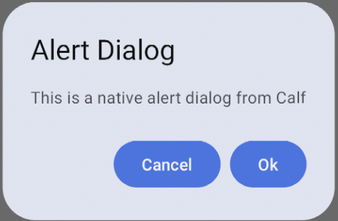
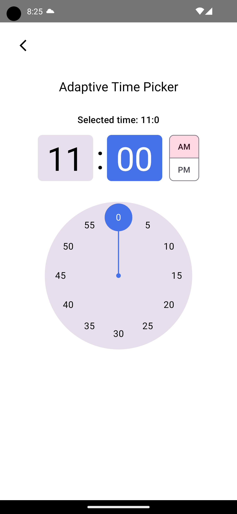
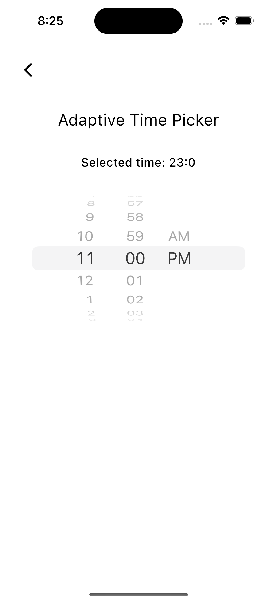

# Adaptive UI

## Installation

[](https://search.maven.org/search?q=g:%22com.mohamedrejeb.calf%22%20AND%20a:%calf-ui%22)

Add the following dependency to your module `build.gradle.kts` file:

```kotlin
api("com.mohamedrejeb.calf:calf-ui:0.3.0")
```

If you are using `calf-ui` artifact, make sure to export it to binaries:

#### Regular Framewoek
```kotlin
...
kotlin {
    ...
    targets
        .filterIsInstance<KotlinNativeTarget>()
        .filter { it.konanTarget.family == Family.IOS }
        .forEach {
            it.binaries.framework {
                ...
                export("com.mohamedrejeb.calf:calf-ui:0.3.0")
            }
        }
    ...
}
...
```

#### CocoaPods
```kotlin
...
kotlin {
    ...
    cocoapods {
        ...
        framework {
            ...
            export("com.mohamedrejeb.calf:calf-ui:0.3.0")
        }
    }
    ...
}
...
```

> **Important:** Exporting `calf-ui` to binaries is required to make it work on iOS.

## Usage

#### AdaptiveAlertDialog

`AdaptiveAlertDialog` is a dialog that adapts to the platform it is running on. It is a wrapper around `AlertDialog` on Android and `UIAlertController` on iOS.

| Android                                                         | iOS                                                     |
|-----------------------------------------------------------------|---------------------------------------------------------|
|  |  |

```kotlin
var showDialog by remember { mutableStateOf(false) }

Button(
    onClick = { showDialog = true },
) {
    Text("Show Alert Dialog")
}

if (showDialog) {
    AdaptiveAlertDialog(
        onConfirm = { showDialog = false },
        onDismiss = { showDialog = false },
        confirmText = "Ok",
        dismissText = "Cancel",
        title = "Alert Dialog",
        text = "This is a native alert dialog from Calf",
    )
}
```

#### AdaptiveBottomSheet

`AdaptiveBottomSheet` is a bottom sheet that adapts to the platform it is running on. It is a wrapper around `ModalBottomSheet` on Android and `UIModalPresentationPopover` on iOS.

| Android                                                         | iOS                                                     |
|-----------------------------------------------------------------|---------------------------------------------------------|
|  |  |

```kotlin
val scope = rememberCoroutineScope()
val sheetState = rememberAdaptiveSheetState()
var openBottomSheet by remember { mutableStateOf(false) }

Box(
    modifier = Modifier.fillMaxSize()
) {
    Button(
        onClick = { openBottomSheet = true },
    ) {
        Text("Show Bottom Sheet")
    }

    if (openBottomSheet) {
        AdaptiveBottomSheet(
            onDismissRequest = { openBottomSheet = false },
            adaptiveSheetState = sheetState,
        ) {
            Button(
                onClick = {
                    scope.launch { sheetState.hide() }.invokeOnCompletion {
                        if (!sheetState.isVisible) {
                            openBottomSheet = false
                        }
                    }
                }
            ) {
                Text("Close")
            }
        }
    }
}
```

#### AdaptiveCircularProgressIndicator

`AdaptiveCircularProgressIndicator` is a circular progress indicator that adapts to the platform it is running on. It is a wrapper around `CircularProgressIndicator` on Android, and it implements similar look to `UIActivityIndicatorView` on iOS.

| Android                                                                                      | iOS                                                                                  |
|----------------------------------------------------------------------------------------------|--------------------------------------------------------------------------------------|
|  |  |

```kotlin
AdaptiveCircularProgressIndicator(
    modifier = Modifier.size(50.dp),
    color = Color.Red,
)
```

#### AdaptiveDatePicker

`AdaptiveDatePicker` is a date picker that adapts to the platform it is running on. It is a wrapper around `DatePicker` on Android and `UIDatePicker` on iOS.

| Android                                                       | iOS                                                   |
|---------------------------------------------------------------|-------------------------------------------------------|
|  |  |

```kotlin
val state = rememberAdaptiveDatePickerState()

LaunchedEffect(state.selectedDateMillis) {
    // Do something with the selected date
}

AdaptiveDatePicker(
    state = state,
)
```

#### AdaptiveTimePicker

`AdaptiveTimePicker` is a time picker that adapts to the platform it is running on. It is a wrapper around `TimePicker` on Android and `UIDatePicker` on iOS.

| Android                                                       | iOS                                                   |
|---------------------------------------------------------------|-------------------------------------------------------|
|  |  |

```kotlin
val state = rememberAdaptiveTimePickerState()

LaunchedEffect(state.hour, state.minute) {
    // Do something with the selected time
}

AdaptiveTimePicker(
    state = state,
    modifier = Modifier
)
```

#### WebView

`WebView` is a view that adapts to the platform it is running on. It is a wrapper around `WebView` on Android, `WKWebView` on iOS and JavaFX `WebView` on Desktop.

| Android                                         | iOS                                     |
|-------------------------------------------------|-----------------------------------------|
|  |  |

```kotlin
val state = rememberWebViewState(
    url = "https://github.com/MohamedRejeb"
)

LaunchedEffect(state.isLoading) {
    // Get the current loading state
}

WebView(
    state = state,
    modifier = Modifier
        .fillMaxSize()
)
```

#### Web View Settings

You can customize the web view settings by changing the `WebSettings` object in the `WebViewState`:

```kotlin
val state = rememberWebViewState(
    url = "https://github.com/MohamedRejeb"
)

LaunchedEffect(Unit) {
    // Enable JavaScript
    state.settings.javaScriptEnabled = true

    // Enable Zoom in Android
    state.settings.androidSettings.supportZoom = true
}
```

#### Call JavaScript

You can call JavaScript functions from the web view by using the `evaluateJavaScript` function:

```kotlin
val state = rememberWebViewState(
    url = "https://github.com/MohamedRejeb"
)

LaunchedEffect(Unit) {
    val jsCode = """
        document.body.style.backgroundColor = "red";
        document.title
    """.trimIndent()

    // Evaluate the JavaScript code
    state.evaluateJavaScript(jsCode) {
        // Do something with the result
        println("JS Response: $it")
    }
}
```

> **Note:** The `evaluateJavaScript` method only works when you enable JavaScript in the web view settings.