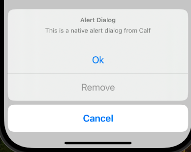
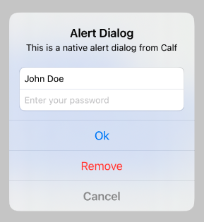

# AdaptiveAlertDialog

Calf provides two different alert dialog composables that adapt to the platform they're running on:

1. **AdaptiveAlertDialog**: A simpler API with predefined confirm and dismiss buttons
2. **AdaptiveBasicAlertDialog**: A more flexible API that allows fully custom content on Material platforms and advanced configuration on iOS

Both composables use native `UIAlertController` on iOS and Material dialogs on other platforms (Android, Desktop, Web).

| Material (Android, Desktop, Web)                                | Cupertino (iOS)                                         |
|-----------------------------------------------------------------|---------------------------------------------------------|
|  |  |

## AdaptiveAlertDialog

The `AdaptiveAlertDialog` composable provides a simple API with predefined confirm and dismiss buttons. It's ideal for common dialog scenarios where you just need to show a message with two action buttons.

```kotlin
// State to control dialog visibility
var showDialog by remember { mutableStateOf(false) }

// Button to trigger the dialog
Button(
    onClick = { showDialog = true },
) {
    Text("Show Alert Dialog")
}

// Show the dialog when state is true
if (showDialog) {
    AdaptiveAlertDialog(
        onConfirm = { 
            // Handle confirmation
            showDialog = false 
        },
        onDismiss = { 
            // Handle dismissal
            showDialog = false 
        },
        confirmText = "OK",
        dismissText = "Cancel",
        title = "Alert Dialog",
        text = "This is a native alert dialog from Calf",
        // Optional: Customize iOS dialog style
        iosDialogStyle = AlertDialogIosStyle.Alert, // or ActionSheet
        iosConfirmButtonStyle = AlertDialogIosActionStyle.Default,
        iosDismissButtonStyle = AlertDialogIosActionStyle.Destructive,
    )
}
```

## AdaptiveBasicAlertDialog

The `AdaptiveBasicAlertDialog` composable provides a more flexible API that allows fully custom content on Material platforms and advanced configuration on iOS through the `iosProperties` parameter. It's marked with `@ExperimentalCalfUiApi` annotation.

```kotlin
// State to control dialog visibility
var showComplexDialog by remember { mutableStateOf(false) }

// Configure iOS-specific properties
val iosProperties = rememberAlertDialogIosProperties(
    title = "Custom Dialog",
    text = "This dialog has custom content",
    style = AlertDialogIosStyle.Alert,
    actions = listOf(
        AlertDialogIosAction(
            title = "OK",
            style = AlertDialogIosActionStyle.Default,
            onClick = { showComplexDialog = false }
        ),
        AlertDialogIosAction(
            title = "Cancel",
            style = AlertDialogIosActionStyle.Cancel,
            onClick = { showComplexDialog = false }
        )
    )
)

// Show the dialog when state is true
if (showComplexDialog) {
    AdaptiveBasicAlertDialog(
        onDismissRequest = { showComplexDialog = false },
        iosProperties = iosProperties,
        materialContent = {
            // Custom content for Material platforms
            Surface(
                shape = RoundedCornerShape(28.dp),
                color = MaterialTheme.colorScheme.surface,
                tonalElevation = 6.dp
            ) {
                Column(
                    modifier = Modifier.padding(24.dp),
                    horizontalAlignment = Alignment.CenterHorizontally
                ) {
                    Text(
                        "Custom Dialog",
                        style = MaterialTheme.typography.headlineSmall
                    )
                    Spacer(modifier = Modifier.height(16.dp))
                    Text("This dialog has fully custom content on Material platforms")
                    Spacer(modifier = Modifier.height(24.dp))
                    Row(
                        modifier = Modifier.fillMaxWidth(),
                        horizontalArrangement = Arrangement.End
                    ) {
                        TextButton(onClick = { showComplexDialog = false }) {
                            Text("Cancel")
                        }
                        Button(onClick = { showComplexDialog = false }) {
                            Text("OK")
                        }
                    }
                }
            }
        }
    )
}
```

## iOS Action Sheet Style

On iOS, you can display the dialog as an action sheet that slides up from the bottom of the screen:

```kotlin
// State to control dialog visibility
var showActionSheetDialog by remember { mutableStateOf(false) }

// Configure iOS-specific properties
val actionSheetProperties = rememberAlertDialogIosProperties(
    title = "Choose an Option",
    text = "Select one of the following actions",
    style = AlertDialogIosStyle.ActionSheet,
    actions = listOf(
        AlertDialogIosAction(
            title = "Confirm",
            style = AlertDialogIosActionStyle.Default,
            onClick = { showActionSheetDialog = false }
        ),
        AlertDialogIosAction(
            title = "Cancel",
            style = AlertDialogIosActionStyle.Cancel,
            onClick = { showActionSheetDialog = false }
        ),
        AlertDialogIosAction(
            title = "Delete",
            style = AlertDialogIosActionStyle.Destructive,
            onClick = { showActionSheetDialog = false }
        ),
    )
)

// Show the action sheet dialog
if (showActionSheetDialog) {
    AdaptiveBasicAlertDialog(
        onDismissRequest = { showActionSheetDialog = false },
        iosProperties = actionSheetProperties,
        materialContent = {
            // Your custom Material UI content here
            // This example focuses on iOS action sheet functionality
        }
    )
}
```

| iOS Action Sheet                                                      |
|-----------------------------------------------------------------------|
|  |

## Dialog with Text Fields (iOS)

On iOS, you can add text fields to your alert dialog for user input:

```kotlin
// State to control dialog visibility
var showComplexDialog by remember { mutableStateOf(false) }

// Configure iOS-specific properties with text fields
val complexProperties = rememberAlertDialogIosProperties(
    title = "Login",
    text = "Please enter your credentials",
    style = AlertDialogIosStyle.Alert,
    severity = AlertDialogIosSeverity.Critical,
    actions = listOf(
        AlertDialogIosAction(
            title = "Login",
            style = AlertDialogIosActionStyle.Default,
            onClick = { showComplexDialog = false }
        ),
        AlertDialogIosAction(
            title = "Cancel",
            style = AlertDialogIosActionStyle.Cancel,
            onClick = { showComplexDialog = false }
        )
    ),
    textFields = listOf(
        AlertDialogIosTextField(
            placeholder = "Email",
            initialValue = "",
            keyboardType = IosKeyboardType.EmailAddress,
            isSecure = false,
            onValueChange = { email -> 
                println("Email: $email") 
            }
        ),
        AlertDialogIosTextField(
            placeholder = "Password",
            initialValue = "",
            isSecure = true,
            onValueChange = { password -> 
                println("Password: $password") 
            }
        )
    )
)

// Show the dialog with text fields
if (showComplexDialog) {
    AdaptiveBasicAlertDialog(
        onDismissRequest = { showComplexDialog = false },
        iosProperties = complexProperties,
        materialContent = {
            // Your custom Material UI content here
            // This example focuses on iOS text field functionality
        }
    )
}
```

| iOS Dialog with Text Fields                                                  |
|------------------------------------------------------------------------------|
|  |

## Customizing Action Styles (iOS)

You can customize the appearance and behavior of actions in your dialog:

```kotlin
// Configure actions with different styles
val actions = listOf(
    AlertDialogIosAction(
        title = "OK",
        style = AlertDialogIosActionStyle.Default,  // Standard button
        onClick = { /* handle OK */ }
    ),
    AlertDialogIosAction(
        title = "Cancel",
        style = AlertDialogIosActionStyle.Cancel,   // Emphasized cancel button
        onClick = { /* handle cancel */ }
    ),
    AlertDialogIosAction(
        title = "Delete",
        style = AlertDialogIosActionStyle.Destructive,  // Red destructive button
        enabled = true,  // Can be disabled with false
        onClick = { /* handle delete */ }
    )
)
```
