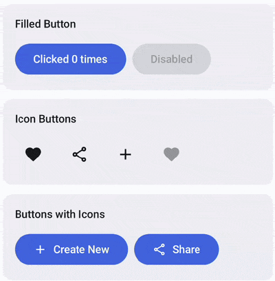
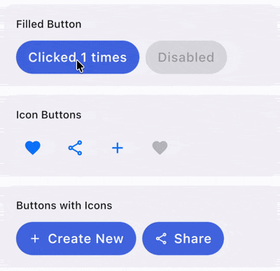
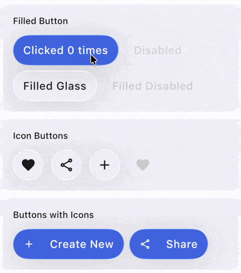

# AdaptiveButton

`AdaptiveButton` is a button composable that adapts to the platform it is running on. On Android, Desktop, and Web, it uses the Material `Button`. On iOS < 26, it uses a Cupertino-style button, and on iOS 26+, it uses a Liquid Glass button.

| Material (Android, Desktop, Web)                                               | Cupertino (iOS < 26)                                                    | Liquid Glass (iOS 26+)                                                                    |
|--------------------------------------------------------------------------------|-------------------------------------------------------------------------|-------------------------------------------------------------------------------------------|
|           |             |          |

## Usage

```kotlin
AdaptiveButton(
    onClick = { /* Handle click */ },
) {
    Text("Click Me")
}
```

## Parameters

| Parameter            | Description                                                                                          |
|----------------------|------------------------------------------------------------------------------------------------------|
| `onClick`            | Called when the button is clicked.                                                                    |
| `modifier`           | The modifier to be applied to the button.                                                            |
| `enabled`            | Whether the button is enabled or disabled.                                                           |
| `shape`              | The shape of the button. Uses `ButtonDefaults.shape` by default (Material platforms).                |
| `colors`             | The colors for the button on Material platforms. Uses `ButtonDefaults.buttonColors()` by default.    |
| `liquidGlassColors`  | Optional color configuration for the Liquid Glass button style on iOS 26+.                           |
| `contentPadding`     | The padding applied to the button content. Uses `ButtonDefaults.ContentPadding` by default.          |
| `interactionSource`  | The `MutableInteractionSource` for the button.                                                       |
| `content`            | The content of the button (typically a `Text` composable).                                           |

## Liquid Glass Colors

On iOS 26+, you can customize the Liquid Glass button appearance using `LiquidGlassButtonColors`:

```kotlin
AdaptiveButton(
    onClick = { /* Handle click */ },
    liquidGlassColors = LiquidGlassButtonDefaults.filledButtonColors(
        tintColor = Color.Blue,
        contentColor = Color.White,
    ),
) {
    Text("Liquid Glass Button")
}
```

## Example

```kotlin
// Basic usage
AdaptiveButton(
    onClick = { println("Button clicked!") },
) {
    Text("Adaptive Button")
}

// With custom colors
AdaptiveButton(
    onClick = { /* Handle click */ },
    colors = ButtonDefaults.buttonColors(
        containerColor = Color.Blue,
        contentColor = Color.White,
    ),
) {
    Text("Custom Colors")
}

// Disabled button
AdaptiveButton(
    onClick = { /* Handle click */ },
    enabled = false,
) {
    Text("Disabled")
}
```
