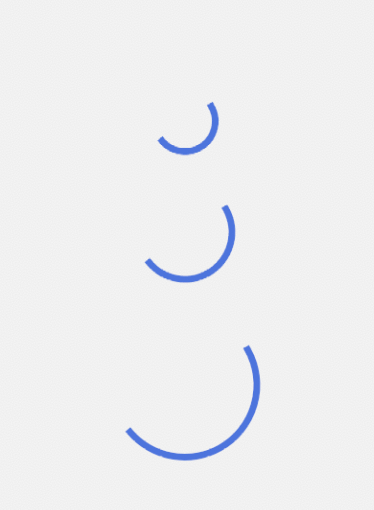

# AdaptiveCircularProgressIndicator

`AdaptiveCircularProgressIndicator` is a circular progress indicator that adapts to the platform it is running on. It is a wrapper around `CircularProgressIndicator` on Android, and it implements similar look to `UIActivityIndicatorView` on iOS.

| Material (Android, Desktop, Web)                                                             | Cupertino (iOS)                                                                      |
|----------------------------------------------------------------------------------------------|--------------------------------------------------------------------------------------|
|  |  |

```kotlin
AdaptiveCircularProgressIndicator(
    modifier = Modifier.size(50.dp),
    color = Color.Red,
)
```