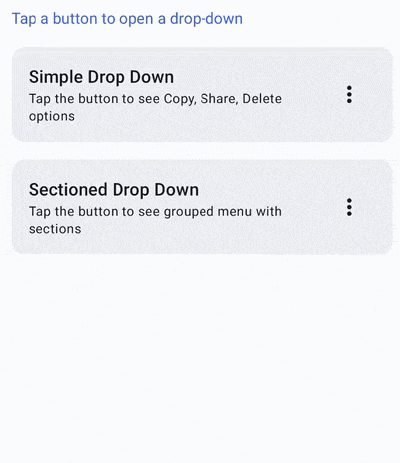
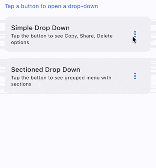
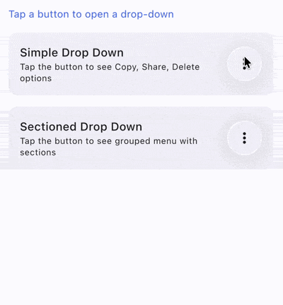

# Drop Down

`AdaptiveDropDown` is an adaptive drop-down menu that uses a native pull-down menu via `UIButton.menu` on iOS and Material3's `DropdownMenu` on other platforms (Android, Desktop, Web).

On iOS, this provides the system drop-down experience with `showsMenuAsPrimaryAction`. On non-iOS platforms, it delegates directly to Material3 `DropdownMenu`.

| Material (Android, Desktop, Web)                                                   | Cupertino (iOS < 26)                                                        | Liquid Glass (iOS 26+)                                                                        |
|------------------------------------------------------------------------------------|-----------------------------------------------------------------------------|-----------------------------------------------------------------------------------------------|
|   |      |  |

## Usage

```kotlin
@OptIn(ExperimentalCalfUiApi::class)
@Composable
fun MyDropDown() {
    var expanded by remember { mutableStateOf(false) }

    Box {
        Button(onClick = { expanded = true }) {
            Text("Show Menu")
        }

        AdaptiveDropDown(
            expanded = expanded,
            onDismissRequest = { expanded = false },
            iosItems = listOf(
                AdaptiveDropDownItem(
                    title = "Edit",
                    onClick = { expanded = false },
                ),
                AdaptiveDropDownItem(
                    title = "Delete",
                    isDestructive = true,
                    onClick = { expanded = false },
                ),
            ),
            materialContent = {
                DropdownMenuItem(
                    text = { Text("Edit") },
                    onClick = { expanded = false },
                )
                DropdownMenuItem(
                    text = { Text("Delete") },
                    onClick = { expanded = false },
                )
            },
        )
    }
}
```

## Parameters

| Parameter            | Description                                                                                                      |
|----------------------|------------------------------------------------------------------------------------------------------------------|
| `expanded`           | Whether the drop-down menu is currently shown.                                                                   |
| `onDismissRequest`   | Called when the menu should be dismissed (e.g. user taps outside).                                                |
| `iosItems`           | The list of `AdaptiveDropDownItem`s to display in the menu on iOS.                                               |
| `modifier`           | The modifier applied to the menu.                                                                                |
| `offset`             | The offset of the menu relative to the anchor.                                                                   |
| `scrollState`        | The scroll state for the menu content.                                                                           |
| `properties`         | Popup properties for the menu.                                                                                   |
| `shape`              | The shape of the menu container.                                                                                 |
| `containerColor`     | The color of the menu container.                                                                                 |
| `tonalElevation`     | The tonal elevation of the menu.                                                                                 |
| `shadowElevation`    | The shadow elevation of the menu.                                                                                |
| `border`             | The border of the menu container.                                                                                |
| `iosSections`        | Optional grouped sections of items. On iOS, rendered as inline sub-menus with visual separators.                 |
| `materialContent`    | Composable to customize how the menu content is rendered on non-iOS platforms.                                    |

## iOS Drop Down Items

Use `AdaptiveDropDownItem` to define menu items:

```kotlin
AdaptiveDropDownItem(
    title = "Delete",
    iosIcon = UIKitImage.systemName("trash"),
    isDestructive = true,
    isDisabled = false,
    onClick = { /* handle */ },
)
```

## Sections

You can group items into sections with visual separators:

```kotlin
AdaptiveDropDown(
    expanded = expanded,
    onDismissRequest = { expanded = false },
    iosItems = emptyList(),
    iosSections = listOf(
        AdaptiveDropDownSection(
            title = "Actions",
            items = listOf(
                AdaptiveDropDownItem(title = "Copy", onClick = { }),
                AdaptiveDropDownItem(title = "Paste", onClick = { }),
            ),
        ),
        AdaptiveDropDownSection(
            title = "Danger Zone",
            items = listOf(
                AdaptiveDropDownItem(title = "Delete", isDestructive = true, onClick = { }),
            ),
        ),
    ),
    materialContent = {
        // Material content with dividers between sections
    },
)
```
