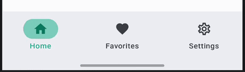
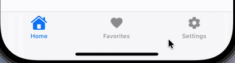
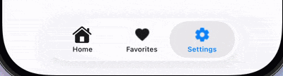

# Navigation Bar

`AdaptiveNavigationBar` is an adaptive navigation bar that uses UIKit's `UITabBar` on iOS and Material3's `NavigationBar` on other platforms (Android, Desktop, Web).

On iOS, the native UITabBar is created using the `iosItems`, `iosSelectedIndex`, and `iosOnItemSelected` parameters. On Material platforms, the `content` lambda is used to provide full customization of the NavigationBar content (typically `NavigationBarItem`s).

| Material (Android, Desktop, Web)                                                       | Cupertino (iOS < 26)                                                            | Liquid Glass (iOS 26+)                                                                            |
|----------------------------------------------------------------------------------------|---------------------------------------------------------------------------------|---------------------------------------------------------------------------------------------------|
|     |        |    |

## Usage

```kotlin
@OptIn(ExperimentalCalfUiApi::class)
@Composable
fun MyNavigationBar() {
    var selectedIndex by remember { mutableIntStateOf(0) }
    val items = listOf("Home", "Search", "Profile")

    AdaptiveNavigationBar(
        // Material content
        content = {
            items.forEachIndexed { index, item ->
                NavigationBarItem(
                    selected = selectedIndex == index,
                    onClick = { selectedIndex = index },
                    icon = { Icon(Icons.Default.Home, contentDescription = item) },
                    label = { Text(item) },
                )
            }
        },
        // iOS-specific parameters
        iosItems = items.map { title ->
            UIKitUITabBarItem(title = title)
        },
        iosSelectedIndex = selectedIndex,
        iosOnItemSelected = { selectedIndex = it },
    )
}
```

## Parameters

| Parameter            | Description                                                                                                  |
|----------------------|--------------------------------------------------------------------------------------------------------------|
| `modifier`           | The modifier to be applied to the navigation bar.                                                            |
| `containerColor`     | The color used for the background of this navigation bar.                                                    |
| `contentColor`       | The preferred color for content inside this navigation bar.                                                  |
| `tonalElevation`     | The tonal elevation of this navigation bar.                                                                  |
| `windowInsets`       | The window insets to be applied to the navigation bar.                                                       |
| `iosItems`           | The list of tab bar items for the iOS UITabBar. See `UIKitUITabBarItem`.                                     |
| `iosSelectedIndex`   | The index of the currently selected item on iOS.                                                             |
| `iosOnItemSelected`  | Callback invoked when an item is selected on iOS, with the item index.                                       |
| `iosConfiguration`   | Configuration for the iOS UITabBar appearance (item tint colors, translucency). See `UIKitTabBarConfiguration`. |
| `content`            | The content of the navigation bar on Material platforms, typically `NavigationBarItem`s within a `RowScope`.  |

## iOS Configuration

You can customize the iOS tab bar appearance using `UIKitTabBarConfiguration`:

```kotlin
AdaptiveNavigationBar(
    iosItems = items,
    iosSelectedIndex = selectedIndex,
    iosOnItemSelected = { selectedIndex = it },
    iosConfiguration = UIKitTabBarConfiguration(
        selectedItemColor = Color.Red,
        unselectedItemColor = Color.Gray,
        isTranslucent = true,
    ),
    content = { /* Material content */ },
)
```

| Property              | Description                                                                                                |
|-----------------------|------------------------------------------------------------------------------------------------------------|
| `selectedItemColor`   | Tint color for selected tab bar items (icon + label). Maps to `UITabBar.tintColor`. Default: iOS system blue. |
| `unselectedItemColor` | Color for unselected tab bar items (icon + label). Note: Liquid Glass (iOS 26+) ignores this property; not yet supported. |
| `isTranslucent`       | Whether the tab bar is translucent. Default: `true`.                                                       |

## iOS Tab Bar Items

Use `UIKitUITabBarItem` to define items for the iOS UITabBar:

```kotlin
UIKitUITabBarItem(
    title = "Home",
    image = UIKitImage.SystemName(SFSymbol.house),
    selectedImage = UIKitImage.SystemName(SFSymbol.houseFill),
)
```

!!! tip
    Use type-safe `SFSymbol` constants from `calf-ui` instead of raw strings. See [SF Symbols & Cupertino Icons](../sf-symbols.md) for details.
