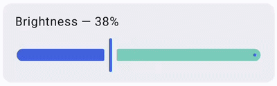
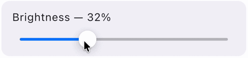
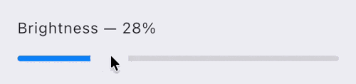

# AdaptiveSlider

`AdaptiveSlider` is a slider composable that adapts to the platform it is running on. On Android, Desktop, and Web, it uses the Material `Slider`. On iOS < 26, it uses a Cupertino-style slider, and on iOS 26+, it uses a Liquid Glass slider.

| Material (Android, Desktop, Web)                                               | Cupertino (iOS < 26)                                                    | Liquid Glass (iOS 26+)                                                                    |
|--------------------------------------------------------------------------------|-------------------------------------------------------------------------|-------------------------------------------------------------------------------------------|
|           |             |          |

## Usage

```kotlin
var sliderValue by remember { mutableFloatStateOf(0.5f) }

AdaptiveSlider(
    value = sliderValue,
    onValueChange = { sliderValue = it },
)
```

## Parameters

| Parameter               | Description                                                                                     |
|-------------------------|-------------------------------------------------------------------------------------------------|
| `value`                 | The current value of the slider.                                                                |
| `onValueChange`         | Called when the slider value changes.                                                           |
| `modifier`              | The modifier to be applied to the slider.                                                       |
| `enabled`               | Whether the slider is enabled or disabled.                                                      |
| `valueRange`            | The range of values the slider can take. Defaults to `0f..1f`.                                  |
| `steps`                 | The number of discrete steps between the start and end values. `0` means continuous.            |
| `onValueChangeFinished` | Called when the user finishes changing the value (e.g., lifts finger).                          |
| `colors`                | The colors for the slider on Material platforms. Uses `SliderDefaults.colors()` by default.     |
| `interactionSource`     | The `MutableInteractionSource` for the slider.                                                  |

## Example

```kotlin
// Basic usage
var sliderValue by remember { mutableFloatStateOf(0.5f) }

AdaptiveSlider(
    value = sliderValue,
    onValueChange = { sliderValue = it },
)

// With custom range
var volume by remember { mutableFloatStateOf(50f) }

AdaptiveSlider(
    value = volume,
    onValueChange = { volume = it },
    valueRange = 0f..100f,
)

// With discrete steps
var rating by remember { mutableFloatStateOf(3f) }

AdaptiveSlider(
    value = rating,
    onValueChange = { rating = it },
    valueRange = 1f..5f,
    steps = 3,
)

// With value change finished callback
var brightness by remember { mutableFloatStateOf(0.5f) }

AdaptiveSlider(
    value = brightness,
    onValueChange = { brightness = it },
    onValueChangeFinished = {
        println("Brightness set to: $brightness")
    },
)

// Disabled slider
AdaptiveSlider(
    value = 0.5f,
    onValueChange = {},
    enabled = false,
)
```
