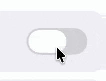

# AdaptiveSwitch

`AdaptiveSwitch` is a switch/toggle composable that adapts to the platform it is running on. On Android, Desktop, and Web, it uses the Material `Switch`. On iOS < 26, it uses a Cupertino-style switch, and on iOS 26+, it uses a Liquid Glass switch.

| Material (Android, Desktop, Web)                                               | Cupertino (iOS < 26)                                                    | Liquid Glass (iOS 26+)                                                                    |
|--------------------------------------------------------------------------------|-------------------------------------------------------------------------|-------------------------------------------------------------------------------------------|
|           |             |          |

## Usage

```kotlin
var checked by remember { mutableStateOf(false) }

AdaptiveSwitch(
    checked = checked,
    onCheckedChange = { checked = it },
)
```

## Parameters

| Parameter            | Description                                                                                       |
|----------------------|---------------------------------------------------------------------------------------------------|
| `checked`            | Whether the switch is checked or unchecked.                                                       |
| `onCheckedChange`    | Called when the switch state changes. Pass `null` to make the switch read-only.                    |
| `modifier`           | The modifier to be applied to the switch.                                                         |
| `thumbContent`       | Optional composable content to display inside the thumb.                                          |
| `enabled`            | Whether the switch is enabled or disabled.                                                        |
| `colors`             | The colors for the switch on Material platforms. Uses `SwitchDefaults.colors()` by default.       |
| `interactionSource`  | The `MutableInteractionSource` for the switch.                                                    |

## Example

```kotlin
// Basic usage
var checked by remember { mutableStateOf(false) }

AdaptiveSwitch(
    checked = checked,
    onCheckedChange = { checked = it },
)

// Disabled switch
AdaptiveSwitch(
    checked = true,
    onCheckedChange = null,
    enabled = false,
)

// With custom Material colors
AdaptiveSwitch(
    checked = checked,
    onCheckedChange = { checked = it },
    colors = SwitchDefaults.colors(
        checkedThumbColor = Color.White,
        checkedTrackColor = Color.Green,
    ),
)

// With thumb content
AdaptiveSwitch(
    checked = checked,
    onCheckedChange = { checked = it },
    thumbContent = {
        Icon(
            imageVector = if (checked) Icons.Default.Check else Icons.Default.Close,
            contentDescription = null,
            modifier = Modifier.size(SwitchDefaults.IconSize),
        )
    },
)
```
