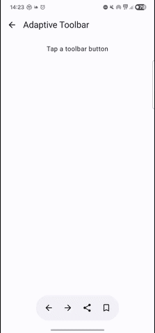
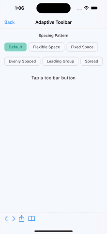

# Toolbar

`AdaptiveToolbar` is an adaptive toolbar that uses a native `UIToolbar` with Liquid Glass on iOS 26+ and a Material 3 Expressive `HorizontalFloatingToolbar` on other platforms (Android, Desktop, Web, and older iOS).

This toolbar is intended for contextual action buttons (not navigation), similar to a web browser's bottom toolbar with back, forward, share, and bookmark buttons.

| Material (Android, Desktop, Web)                                           | Cupertino (iOS < 26)                                                |
|----------------------------------------------------------------------------|---------------------------------------------------------------------|
|     |        |

## Usage

```kotlin
@OptIn(ExperimentalCalfUiApi::class)
@Composable
fun MyToolbar() {
    var expanded by remember { mutableStateOf(true) }

    AdaptiveToolbar(
        expanded = expanded,
        // Material content
        content = {
            IconButton(onClick = { /* back */ }) {
                Icon(Icons.AutoMirrored.Default.ArrowBack, contentDescription = "Back")
            }
            IconButton(onClick = { /* forward */ }) {
                Icon(Icons.AutoMirrored.Default.ArrowForward, contentDescription = "Forward")
            }
            IconButton(onClick = { /* share */ }) {
                Icon(Icons.Default.Share, contentDescription = "Share")
            }
        },
        // iOS-specific parameters
        iosItems = listOf(
            UIKitUIBarButtonItem.systemItem(
                systemItem = UIKitUIBarButtonSystemItem.Reply,
                onClick = { /* back */ }
            ),
            UIKitUIBarButtonItem.flexibleSpace(),
            UIKitUIBarButtonItem.systemItem(
                systemItem = UIKitUIBarButtonSystemItem.Action,
                onClick = { /* share */ }
            ),
        ),
    )
}
```

## Parameters

| Parameter            | Description                                                                                                      |
|----------------------|------------------------------------------------------------------------------------------------------------------|
| `expanded`           | Whether the toolbar is in its expanded state.                                                                    |
| `modifier`           | The modifier to be applied to the toolbar.                                                                       |
| `leadingContent`     | Optional leading content for the Material 3 Expressive floating toolbar.                                         |
| `trailingContent`    | Optional trailing content for the Material 3 Expressive floating toolbar.                                        |
| `content`            | The main content composable for the Material 3 Expressive floating toolbar. Typically a row of `IconButton`s.    |
| `iosItems`           | The list of bar button items for the iOS native toolbar. See `UIKitUIBarButtonItem`.                             |
