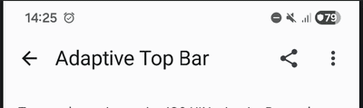
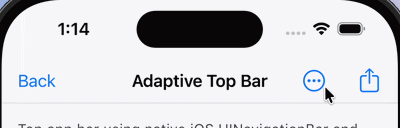
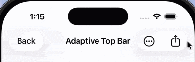
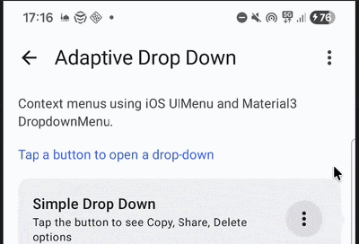
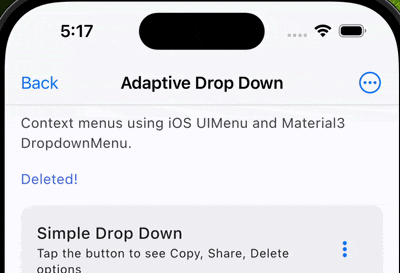
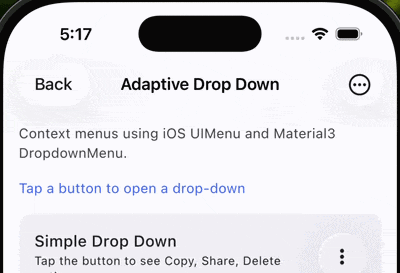

# Top Bar

`AdaptiveTopBar` is an adaptive top app bar that uses UIKit's `UINavigationBar` on iOS and Material3's `TopAppBar` on other platforms (Android, Desktop, Web).

On iOS, a native UINavigationBar is created using the `iosTitle`, `iosLeadingItems`, `iosTrailingItems`, and `iosConfiguration` parameters. On Material platforms, the standard Material3 `TopAppBar` parameters are used.

| Material (Android, Desktop, Web)                                               | Cupertino (iOS < 26)                                                        | Liquid Glass (iOS 26+)                                                                        |
|--------------------------------------------------------------------------------|-----------------------------------------------------------------------------|-----------------------------------------------------------------------------------------------|
|     |            |        |

## Usage

```kotlin
@OptIn(ExperimentalMaterial3Api::class, ExperimentalCalfUiApi::class)
@Composable
fun MyScreen() {
    AdaptiveTopBar(
        title = { Text("My Screen") },
        navigationIcon = {
            IconButton(onClick = { /* navigate back */ }) {
                Icon(Icons.AutoMirrored.Default.ArrowBack, contentDescription = "Back")
            }
        },
        actions = {
            IconButton(onClick = { /* action */ }) {
                Icon(Icons.Default.Settings, contentDescription = "Settings")
            }
        },
        // iOS-specific parameters
        iosTitle = "My Screen",
        iosLeadingItems = listOf(
            UIKitUIBarButtonItem.systemItem(
                systemItem = UIKitUIBarButtonSystemItem.Close,
                onClick = { /* navigate back */ }
            )
        ),
        iosTrailingItems = listOf(
            UIKitUIBarButtonItem.title(
                title = "Settings",
                onClick = { /* action */ }
            )
        ),
    )
}
```

## Parameters

| Parameter            | Description                                                                                                      |
|----------------------|------------------------------------------------------------------------------------------------------------------|
| `modifier`           | The modifier to be applied to the top bar.                                                                       |
| `title`              | The title composable for Material3 TopAppBar.                                                                    |
| `navigationIcon`     | The navigation icon composable for Material3 TopAppBar.                                                          |
| `actions`            | The action icons composable for Material3 TopAppBar.                                                             |
| `expandedHeight`     | The expanded height of the Material3 TopAppBar.                                                                  |
| `windowInsets`       | The window insets for the Material3 TopAppBar.                                                                   |
| `colors`             | The colors for the Material3 TopAppBar. Uses `TopAppBarDefaults.topAppBarColors()` by default.                   |
| `scrollBehavior`     | The scroll behavior for the Material3 TopAppBar.                                                                 |
| `iosTitle`           | The title string for the iOS UINavigationBar.                                                                    |
| `iosLeadingItems`    | The list of bar button items on the leading side of the iOS navigation bar. See `UIKitUIBarButtonItem`.          |
| `iosTrailingItems`   | The list of bar button items on the trailing side of the iOS navigation bar. See `UIKitUIBarButtonItem`.         |
| `iosConfiguration`   | Configuration for the iOS UINavigationBar appearance. See `UIKitNavigationBarConfiguration`.                     |

## iOS Configuration

You can customize the iOS navigation bar appearance using `UIKitNavigationBarConfiguration`:

```kotlin
AdaptiveTopBar(
    title = { Text("Large Title") },
    iosTitle = "Large Title",
    iosConfiguration = UIKitNavigationBarConfiguration(
        prefersLargeTitles = true,
        isTranslucent = true,
        titleColor = Color.Red,
    ),
)
```

| Property              | Description                                                                                              |
|-----------------------|----------------------------------------------------------------------------------------------------------|
| `prefersLargeTitles`  | Whether the navigation bar should display large titles. Default: `false`.                                |
| `isTranslucent`       | Whether the navigation bar is translucent. Default: `true`.                                              |
| `titleColor`          | The color of the navigation bar title text. When `Color.Unspecified`, the default iOS title color is used. |

## iOS Bar Button Items

Use `UIKitUIBarButtonItem` factory functions to create bar button items for iOS:

```kotlin
// Title-based item
UIKitUIBarButtonItem.title(
    title = "Done",
    onClick = { /* handle */ }
)

// System item
UIKitUIBarButtonItem.systemItem(
    systemItem = UIKitUIBarButtonSystemItem.Add,
    onClick = { /* handle */ }
)

// Flexible space (expands to fill available width)
UIKitUIBarButtonItem.flexibleSpace()

// Fixed-width space
UIKitUIBarButtonItem.fixedSpace(width = 16.0)
```

!!! tip
    Use type-safe `SFSymbol` constants from `calf-ui` instead of raw strings for icon names. See [SF Symbols & Cupertino Icons](../sf-symbols.md) for details.

### Bar Button Item with Menu

You can attach a native drop-down menu to a bar button item on iOS using `UIKitUIBarButtonItem.withMenu()`.
This uses the native `UIBarButtonItem.menu` API (iOS 14+), providing smooth system animations anchored to the bar button — no overlay hacks needed.

On Material platforms, use a standard `DropdownMenu` inside the `actions` slot.

| Material | Cupertino | Liquid Glass |
|----------|-----------|--------------|
|  |  |  |

```kotlin
@OptIn(ExperimentalMaterial3Api::class, ExperimentalCalfUiApi::class)
@Composable
fun MyScreen() {
    var expanded by remember { mutableStateOf(false) }

    AdaptiveTopBar(
        title = { Text("My Screen") },
        actions = {
            // Material platforms: standard DropdownMenu
            Box {
                IconButton(onClick = { expanded = true }) {
                    Icon(Icons.Filled.MoreVert, contentDescription = "More")
                }
                DropdownMenu(
                    expanded = expanded,
                    onDismissRequest = { expanded = false },
                ) {
                    DropdownMenuItem(
                        text = { Text("Edit") },
                        onClick = { expanded = false },
                    )
                    DropdownMenuItem(
                        text = { Text("Delete") },
                        onClick = { expanded = false },
                    )
                }
            }
        },
        // iOS: native pull-down menu on the bar button
        iosTitle = "My Screen",
        iosTrailingItems = listOf(
            UIKitUIBarButtonItem.withMenu(
                image = UIKitImage.SystemName(SFSymbol.ellipsisCircle),
                menuItems = listOf(
                    AdaptiveDropDownItem(
                        title = "Edit",
                        iosIcon = UIKitImage.SystemName(SFSymbol.pencil),
                        onClick = { /* handle */ },
                    ),
                    AdaptiveDropDownItem(
                        title = "Delete",
                        iosIcon = UIKitImage.SystemName(SFSymbol.trash),
                        isDestructive = true,
                        onClick = { /* handle */ },
                    ),
                ),
            ),
        ),
    )
}
```

!!! note
    When a menu is provided, the `onClick` of the bar button item is ignored — the menu is shown as the primary action.

See also: [Drop Down](adaptive-drop-down.md) for more details on `AdaptiveDropDownItem` and sections.
