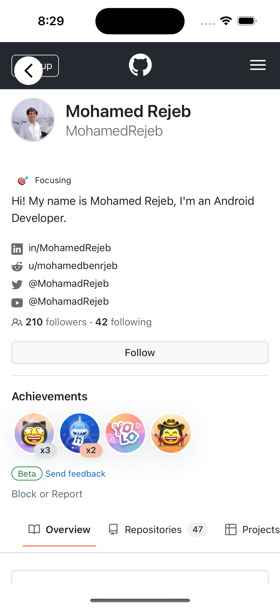

# File Picker

## Installation

[](https://search.maven.org/search?q=g:%22com.mohamedrejeb.calf%22%20AND%20a:%calf-webview%22)

Add the following dependency to your module `build.gradle.kts` file:

```kotlin
implementation("com.mohamedrejeb.calf:calf-webview:0.7.1")
```

## Usage

`WebView` is a view that adapts to the platform it is running on. It is a wrapper around `WebView` on Android, `WKWebView` on iOS and JavaFX `WebView` on Desktop.

| Android                                         | iOS                                     |
|-------------------------------------------------|-----------------------------------------|
|  |  |

```kotlin
val state = rememberWebViewState(
    url = "https://github.com/MohamedRejeb"
)

LaunchedEffect(state.isLoading) {
    // Get the current loading state
}

WebView(
    state = state,
    modifier = Modifier
        .fillMaxSize()
)
```

#### Web View Settings

You can customize the web view settings by changing the `WebSettings` object in the `WebViewState`:

```kotlin
val state = rememberWebViewState(
    url = "https://github.com/MohamedRejeb"
)

LaunchedEffect(Unit) {
    // Enable JavaScript
    state.settings.javaScriptEnabled = true

    // Enable Zoom in Android
    state.settings.androidSettings.supportZoom = true
}
```

#### Call JavaScript

You can call JavaScript functions from the web view by using the `evaluateJavaScript` function:

```kotlin
val state = rememberWebViewState(
    url = "https://github.com/MohamedRejeb"
)

LaunchedEffect(Unit) {
    val jsCode = """
        document.body.style.backgroundColor = "red";
        document.title
    """.trimIndent()

    // Evaluate the JavaScript code
    state.evaluateJavaScript(jsCode) {
        // Do something with the result
        println("JS Response: $it")
    }
}
```

> **Note:** The `evaluateJavaScript` method only works when you enable JavaScript in the web view settings.