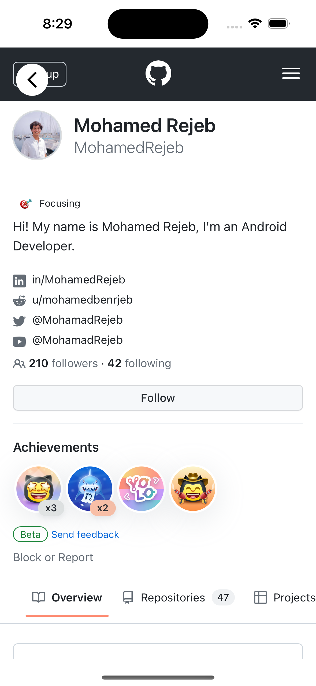

# Web View

## Installation

[](https://search.maven.org/search?q=g:%22com.mohamedrejeb.calf%22%20AND%20a:%calf-webview%22)

Add the following dependency to your module `build.gradle.kts` file:

```kotlin
implementation("com.mohamedrejeb.calf:calf-webview:{{ calf_version }}")
```

## Usage

`WebView` is a view that adapts to the platform it is running on. It is a wrapper around `WebView` on Android, `WKWebView` on iOS, JavaFX `WebView` on Desktop, and an `iframe` on Web (JS/WasmJS).

| Android                                         | iOS                                     |
|-------------------------------------------------|-----------------------------------------|
|  |  |

```kotlin
val state = rememberWebViewState(
    url = "https://github.com/MohamedRejeb"
)

LaunchedEffect(state.isLoading) {
    // Get the current loading state
}

WebView(
    state = state,
    modifier = Modifier
        .fillMaxSize()
)
```

#### Web View Settings

You can customize the web view settings by changing the `WebSettings` object in the `WebViewState`:

```kotlin
val state = rememberWebViewState(
    url = "https://github.com/MohamedRejeb"
)

LaunchedEffect(Unit) {
    // Enable JavaScript
    state.settings.javaScriptEnabled = true

    // Enable Zoom in Android
    state.settings.androidSettings.supportZoom = true
}
```

#### Call JavaScript

You can call JavaScript functions from the web view by using the `evaluateJavaScript` function:

```kotlin
val state = rememberWebViewState(
    url = "https://github.com/MohamedRejeb"
)

LaunchedEffect(Unit) {
    val jsCode = """
        document.body.style.backgroundColor = "red";
        document.title
    """.trimIndent()

    // Evaluate the JavaScript code
    state.evaluateJavaScript(jsCode) {
        // Do something with the result
        println("JS Response: $it")
    }
}
```

> **Note:** The `evaluateJavaScript` method only works when you enable JavaScript in the web view settings.

#### Cookie Management

You can manage cookies in the web view using the `CookieManager` available through the `WebViewState`:

```kotlin
val state = rememberWebViewState(
    url = "https://github.com/MohamedRejeb"
)

WebView(
    state = state,
    modifier = Modifier.fillMaxSize()
)
```

##### Set a Cookie

```kotlin
LaunchedEffect(Unit) {
    state.cookieManager.setCookie(
        url = "https://github.com",
        cookie = Cookie(
            name = "session",
            value = "abc123",
            domain = ".github.com",
            path = "/",
            isSecure = true,
            isHttpOnly = true,
        )
    )
}
```

##### Get Cookies

```kotlin
LaunchedEffect(Unit) {
    val cookies = state.cookieManager.getCookies("https://github.com")
    cookies.forEach { cookie ->
        println("Cookie: ${cookie.name} = ${cookie.value}")
    }
}
```

##### Remove All Cookies

```kotlin
LaunchedEffect(Unit) {
    state.cookieManager.removeAllCookies()
}
```

##### Cookie Properties

The `Cookie` data class supports the following properties:

| Property      | Type      | Description                                                  |
|---------------|-----------|--------------------------------------------------------------|
| `name`        | `String`  | The name of the cookie.                                      |
| `value`       | `String`  | The value of the cookie.                                     |
| `domain`      | `String?` | The domain for which the cookie is valid.                    |
| `path`        | `String?` | The path for which the cookie is valid.                      |
| `expiresDate` | `Long?`   | Expiration date in milliseconds since epoch. `null` = session cookie. |
| `isSecure`    | `Boolean` | Whether the cookie should only be sent over HTTPS.           |
| `isHttpOnly`  | `Boolean` | Whether the cookie is HTTP-only (not accessible via JavaScript). |

> **Note:** Cookie management is supported on Android, iOS, and Desktop. Web (JS/WasmJS) platforms are not yet supported for cookie management.